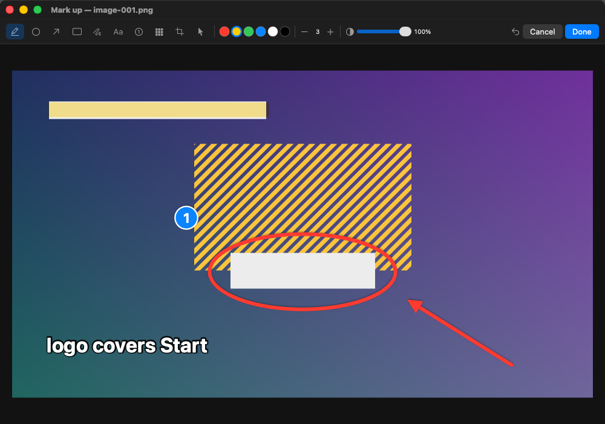
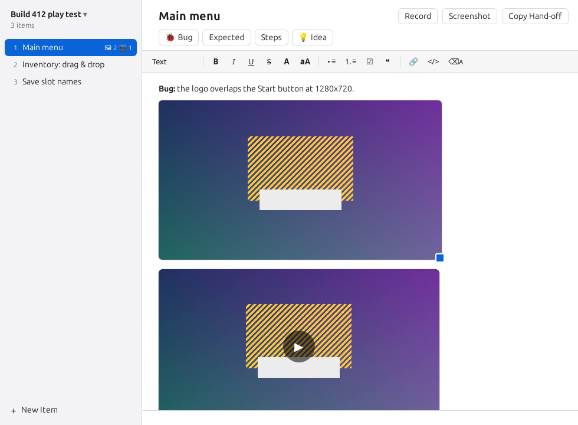

# Snagbook

**A notebook for testing sessions on macOS, Linux and Windows: numbered findings, each with a note, marked-up screenshots and screen recordings, kept as plain folders anyone can read.**

<p align="center"></p>

When you play-test a game or click through an app, the findings pile up faster than you can write them down. Snagbook stays open beside what you are testing; on macOS it can stay above full-screen games too. Every finding is an item with a title, a note and its pictures and videos. A screenshot or a recording is one key press and a drag away, from any app, and it lands in the note you are writing.

- **Start a session** for one sitting of testing.
- **Add an item** per finding, type what happened, press a key to grab a screenshot (and circle what matters on it) or record what happens.
- **Hand it off**: one key copies a short text that points whoever fixes things — a colleague or a coding assistant — at the session.

Everything is saved as ordinary files while you type: a folder per session, a folder per item, Markdown notes, PNG pictures and MP4 videos. Every video gets a still frame per second and a contact sheet beside it, so someone (or something) that cannot play it can still see what happened. There is nothing to export.

## Contents

- [Install](#install)
- [Quick start](#quick-start)
- [A tour](#a-tour)
- [Keyboard shortcuts](#keyboard-shortcuts)
- [Settings](#settings)
- [What it touches](#what-it-touches)
- [Limits](#limits)
- [Linux and Windows](#linux-and-windows)
- [License](#license)

## Install

### macOS

Snagbook needs macOS 14 (Sonoma) or newer. It is built from source with the Swift toolchain (Xcode or the Command Line Tools) and Node.js, which builds the note editor once:

```sh
git clone https://github.com/Morass/snagbook.git
cd snagbook
make install          # builds Snagbook.app and copies it to /Applications
```

`make install DESTDIR=~/Applications` puts it somewhere else; `make uninstall` removes it.

The first screenshot or recording asks for the **Screen Recording** permission (System Settings › Privacy & Security › Screen & System Audio Recording). Turn Snagbook on there, then quit and reopen it.

### Linux and Windows

Download the package for your system from the [Releases](https://github.com/Morass/snagbook/releases) page:

- **Debian, Ubuntu and relatives:** `sudo apt install ./Snagbook_0.1.0_amd64.deb`
- **Other Linux systems:** make the `.AppImage` executable with `chmod +x`, then run it.
- **Windows 10 and 11:** run `Snagbook_0.1.0_x64-setup.exe`. It is not signed, so SmartScreen may require **More info → Run anyway** the first time.

Install **ffmpeg** for video files (`sudo apt install ffmpeg` or `winget install ffmpeg`). Without it, recordings still keep their still frames and contact sheet. Building these versions from source is covered in [the desktop guide](desktop/README.md#building-from-source).

## Quick start

The steps below show the macOS keys. On Linux and Windows, use **Ctrl+Alt+S** for a screenshot, **Ctrl+Alt+R** for recording, **Ctrl+N** for a new item and **Ctrl+Shift+C** for Copy Hand-off.

1. Open Snagbook and press **New Session**. The first item, *Item 1*, is ready with its title selected: type what the finding is about and press Return.
2. Type the note. Paste or drop pictures into it.
3. Press **⌃⌘S** in any app, drag a rectangle around the problem and let go. Circle or highlight it in the mark-up window and press Return; the picture goes into the note.
4. To show something happening, press **⌃⌘R**, drag the area, do it, and press **⌃⌘R** (or Stop) again.
5. **⌘N** — or **⌃⌘N** from any app — starts the next item.
6. When you are done, press **⇧⌘C** (Copy Hand-off) and paste the text wherever the fixing happens.

## A tour

### Sessions and items

A session is one sitting of testing. The name at the top of the sidebar switches between recent sessions, starts a new one, renames or deletes this one, edits its header, opens a session folder from anywhere else (one a colleague shared, say) or shows it in the Finder. The recent list is read from disk each time you open it, so sessions removed elsewhere disappear. A session is named after the time it started until you give it a name. Deleting a session moves its whole folder to the Trash; on a drive without a Trash, Snagbook asks before deleting it for good.

Each finding is an item, numbered in order. Click an item or use the arrow keys; drag to reorder; right-click to rename, show in the Finder or delete. **⌘[** and **⌘]** go back and forward through the items you looked at. Deleting moves the item's folder to the Trash; on a drive without a Trash (a network share, for example) Snagbook asks before deleting it for good. After the last items are deleted, the next new one takes their number again.

The note is a small word processor — headings, bold and italic, colours and sizes, lists, checklists, quotes, links and code — saved as Markdown while you type. The buttons above it (**Bug**, **Expected**, **Steps**, **Idea**) type a ready-made start where the cursor is; **⌘1**…**⌘9** do the same, and you can write your own in Settings › Templates or Templates › New Template….

### Screenshots and mark-up

<p align="center"></p>

Press **⌃⌘S** anywhere (or the camera button in the toolbar) and drag a rectangle; **F** takes the whole screen, **Esc** cancels. The picture opens in the mark-up window, then goes into the item you are looking at, at the cursor. Double-click any picture in a note to mark it up again later.

Pick a tool and drag on the picture: **highlighter**, **circle**, **arrow**, **box**, **pen**, **text**, a **numbered marker** (1, 2, 3 … in order), **blur** to hide something, **crop**, or **select** to move, recolour or delete a mark. The **opacity** slider makes marks see-through, so the picture shows under them. **Return** or the green ✓ saves; **Esc** or ✕ keeps the picture as it was; **⌘⌫** or the red bin throws a new screenshot away.

The untouched picture is kept beside the marked-up one (`shot-001.orig.png`, with the marks in `shot-001.marks.json`), so marks can be moved, changed or removed later — remove every mark and the original comes back.

### Recordings

<p align="center"></p>

Press **⌃⌘R** anywhere (or the record button), drag the area to record, and use what you are testing. If you started from the notebook, it steps aside only while you choose the area, then returns without taking focus. A small bar shows the time, with **Stop** and a **screenshot** button for a still of the recorded area. Stop with the bar, **⌃⌘R** again or the menu bar icon. The video goes into the item and plays in the note.

Beside every video Snagbook writes what a reader who cannot play it needs: a still frame for each second in `clip-001-frames/`, a contact sheet with timestamps (`clip-001-contact.jpg`), and `clip-001.json` with the length, the size and the list of stills.

### Hand-off

**⇧⌘C** copies a short text for whoever reads the session next: a header you write yourself (Settings › General), with the session's folder filled in. **⇧⌘H** gives one session its own header. Every session also keeps a `README.md` with the header and every item's note in order, so the whole session is one file to read.

### The menu bar

The menu bar icon starts a recording or a screenshot, adds an item, starts or continues a session, copies the hand-off, or brings the notebook back. It shows a filled record symbol while a recording runs.

## Keyboard shortcuts

**Anywhere, even in a full-screen game** (change them in Settings › Shortcuts):

| Keys | What they do |
|---|---|
| ⌃⌘S | Screenshot: drag a rectangle |
| ⌃⌘R | Record: drag the area; again to stop |
| ⌃⌘N | New item |
| ⌃⌘B | Show or hide the notebook |

**In the notebook:**

| Keys | What they do |
|---|---|
| ⌘N | New item |
| ⇧⌘N | New session |
| ⌘O | Open a session |
| ⌘[ ⌘] | Back / forward |
| ⌘1 … ⌘9 | Type a template |
| ⇧⌘C | Copy hand-off |
| ⇧⌘H | Edit the session header |
| ⌥⌘T | Always on top |
| ⌘B ⌘I ⌘U ⇧⌘X | Bold, italic, underline, strikethrough |
| ⌘K | Link |
| ⌘E | Code |
| ⌥⌘1 … ⌥⌘3, ⌥⌘0 | Heading 1–3, body text |
| ⇧⌘8 ⇧⌘7 ⇧⌘9 | Bullets, numbers, checklist |
| ⇧⌘. | Quote |
| ⌘\\ | Clear formatting |
| Delete (in the list) | Delete the item |

**While dragging the rectangle:** F takes the whole screen, Esc cancels.

**In the mark-up window:**

| Keys | What they do |
|---|---|
| H O A R P | Highlighter, circle, arrow, box, pen |
| T N B | Text, numbered marker, blur |
| C V | Crop (a click removes the crop), select |
| 1 … 6 | Colour |
| [ ] | Thinner / thicker |
| , . | More see-through / more solid |
| hold ⇧ while dragging | Square, circle, or an arrow at 45° |
| ⌘Z ⇧⌘Z | Undo / redo |
| ⌫ | Delete the selected mark |
| Return / Esc / ⌘⌫ | Done (✓) / keep as it was (✕) / throw a new screenshot away (bin) |

Hover over any button to see its shortcut.

## Settings

- **General:** where new sessions go (`~/Snagbook` to start with), the folder name of a new session (`{hash}`, `{yyyy}`, `{MM}`, `{dd}`, `{HH}`, `{mm}`), what Copy Hand-off copies (the header, or only the path of the session's `README.md`), keeping the notebook above other windows (also over full-screen apps), and the header for sessions (`{session}`, `{readme}`, `{date}`, `{items}`).
- **Capture:** the frame rate (10, 15 or 30), the largest video size (1280, 1920 or 2560 pixels), the sound the Mac plays, the mouse pointer, opening new screenshots in the mark-up window, and the Screen Recording permission.
- **Shortcuts:** the four keys that work in any app, and a list of all the others.
- **Templates:** the buttons above the note.

The settings are a JSON file you can also edit by hand: `~/Library/Application Support/Snagbook/config.json` on macOS, `~/.config/Snagbook/config.json` on Linux and `%APPDATA%\Snagbook\config.json` on Windows. If Snagbook cannot read it, it says so and does not overwrite it.

## What it touches

- **Your sessions folder**, and any session folder you open:

  ```
  1a2b3c4d_26-09-2026/
    README.md            the header and every item's note
    session.json         the order, titles and numbers of the items
    01-main-menu/
      notes.md           the note, in Markdown
      media/             shot-001.png, image-001.png, clip-001.mp4,
                         shot-001.orig.png, shot-001.marks.json (after mark-up),
                         clip-001-frames/, clip-001-contact.jpg, clip-001.json
  ```

  Folders renamed or removed by hand are noticed the next time the session opens.
- **Its settings file** (above).
- **The Trash**, when you delete an item or a session.
- **The clipboard**, only when you copy the hand-off.
- **The screen**, only while you take a screenshot or record, and only the area you choose; macOS sound only if you turn it on in Settings › Capture.
- **ffmpeg** on Linux and Windows, when installed, to encode recordings.

Snagbook makes no network connections. Links in notes open in your browser when you click them.

## Limits

- Recordings are of a rectangle you drag, not of a single window that moves.
- If an open session's folder is deleted elsewhere, Snagbook closes it when you return to the app and never recreates it.
- On Wayland, global shortcuts are unavailable and recording is not supported; screenshots use the desktop's screen-sharing permission.
- Linux and Windows recordings have no sound.

## Linux and Windows

The Linux and Windows editions have the same notebook, screenshots, mark-up, recordings and session-folder format, so a session made on one system opens on another. Their [platform guide](desktop/README.md) covers shortcuts, dependencies and source builds.

## License

[MIT](LICENSE): use it, change it, share it, sell it. Keep the copyright notice.
