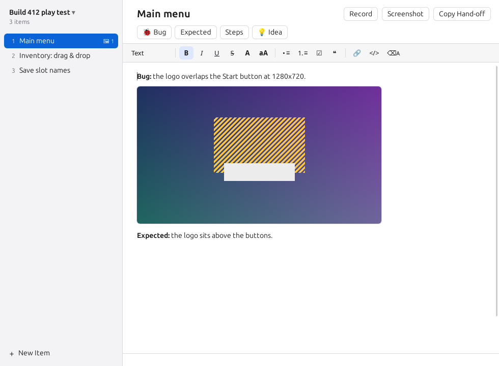

# Snagbook

**A notebook for testing sessions: numbered findings, each with a note, screenshots and recordings, kept as plain folders anyone can read.**

<p align="center"></p>

When you play-test a game or click through an app, the findings pile up faster than you can write them down. Snagbook keeps one window open beside what you are testing. Every finding is an item with a title, a note and its pictures and videos; a screenshot or a recording is one key press and a drag away, and it lands in the note you are writing.

- **Start a session** for one sitting of testing.
- **Add an item** per finding, type what happened, press a key to grab a screenshot (and circle what matters on it) or record what happens.
- **Hand it off**: one click copies a short text that points whoever fixes things at the session.

Everything is saved as ordinary files as you type: a folder per session, a folder per item, Markdown notes, PNG pictures and MP4 videos. Every video gets still frames and a contact sheet beside it, so someone (or something) that cannot play it can still see what happened. There is nothing to export.

It runs on Linux and Windows.

## Contents

- [Install](#install)
- [Quick start](#quick-start)
- [A tour](#a-tour)
- [Keys](#keys)
- [Settings](#settings)
- [What it touches](#what-it-touches)
- [Limits](#limits)
- [Building from source](#building-from-source)
- [License](#license)

## Install

Download the package for your system from the [Releases](../../releases) page:

- **Debian, Ubuntu and relatives:** `sudo apt install ./Snagbook_0.1.0_amd64.deb`
- **Any other Linux:** the `.AppImage`. Make it executable (`chmod +x Snagbook_0.1.0_amd64.AppImage`) and run it.
- **Windows:** the `Snagbook_0.1.0_x64-setup.exe` installer.

To save recordings as video, Snagbook uses **ffmpeg**. On Linux install it with your package manager (`sudo apt install ffmpeg`); on Windows, `winget install ffmpeg`, or put `ffmpeg.exe` next to `snagbook.exe`. Without it, recordings keep their still frames and contact sheet, and Snagbook tells you the video is missing.

Or build it yourself; see [Building from source](#building-from-source).

## Quick start

1. Open Snagbook and press **New Session**. The first item, *Item 1*, is ready and its title is selected: type what the finding is about and press Enter.
2. Type the note. Paste or drop pictures into it.
3. Press **Ctrl+Alt+S** anywhere, drag a rectangle around what matters, and let go. Circle or highlight the problem in the mark-up window and press Enter; the picture goes into the note.
4. To show something happening, press **Ctrl+Alt+R**, drag the area, do it, and press **Ctrl+Alt+R** (or Stop) again.
5. **Ctrl+N** starts the next item.
6. When you are done, press **Copy Hand-off** and paste the text wherever the fixing happens.

## A tour

### Sessions

A session is one sitting of testing. The name at the top of the list (click it) switches between recent sessions, starts a new one, renames this one, or opens a session folder from anywhere else, for example one a colleague shared. A session is named after the time it started until you give it a name.

### Items and notes

Each finding is an item, numbered in order. Click an item or use the arrow keys in the list to move between them; drag an item to reorder it; right-click it to rename it, show its folder or delete it. Deleting moves the item's folder to the Trash. On a drive without a Trash (a network share, for example), Snagbook asks before deleting it for good.

The note is a small word processor: headings, bold and italic, colours, lists, checklists, quotes, links and code. It is saved as Markdown while you type.

The buttons above the note (**Bug**, **Expected**, **Steps**, **Idea**) type a ready-made start, such as `**Bug:** ` or a numbered list of steps, where the cursor is. Ctrl+1 to Ctrl+9 do the same without the mouse, and you can change the buttons in Settings.

### Screenshots

Press **Ctrl+Alt+S** in any app, or the **Screenshot** button. The screen under the mouse freezes, you drag a rectangle over it, and the picture opens in the mark-up window (below). When you are done it is saved into the item you are looking at and put in its note at the cursor. Enter takes the whole screen; Esc cancels. Because the screen is frozen first, nothing that moves while you drag ends up in the picture.

Pictures you paste or drop into a note are saved into the item as well.

### Marking up pictures

A new screenshot opens in the mark-up window; double-click any picture in a note to open it there later. Pick a tool and drag on the picture:

| Key | Tool |
|---|---|
| H | Highlighter (the one it starts with) |
| O | Circle |
| A | Arrow |
| R | Box |
| P | Pen |
| T | Text (click where it goes, type, Enter) |
| N | Numbered marker (1, 2, 3 … in order) |
| B | Blur: hides what is under it |
| C | Crop (a click removes the crop) |
| V | Select: click a mark to move it, recolour it, or delete it with Delete |

1 to 6 choose a colour, [ and ] make lines thinner or thicker, Shift while dragging makes squares and circles, and snaps arrows to 45°. Ctrl+Z undoes, Ctrl+Shift+Z redoes. **Enter** (Done) saves; **Esc** keeps the picture as it was (No Marks); **Ctrl+Backspace** throws a new screenshot away (Discard). To have screenshots go straight into the note instead, turn mark-up off in Settings.

The untouched picture is kept beside the marked-up one (`shot-001.orig.png`, with the marks in `shot-001.marks.json`), so marks can be changed or removed later: remove every mark and the original comes back.

### Recordings

Press **Ctrl+Alt+R** in any app, or the **Record** button, and drag the area to record (Enter records the whole screen). A small bar with a timer and **Stop** appears in a corner the recording does not cover; press Stop, or Ctrl+Alt+R again, to finish. The video goes into the item and into its note, where it plays in place.

Beside every video Snagbook writes what a reader who cannot play it needs: a still frame for every second in `clip-001-frames/`, a contact sheet with timestamps (`clip-001-contact.jpg`), and `clip-001.json` with the length, the size and the list of stills.

### Hand-off

**Copy Hand-off** copies a short text for whoever reads the session next, a colleague or a coding assistant: a header you can write yourself (Settings), with the session's folder filled in. Every session also keeps a `README.md` with the header and every item's note in order, so the whole session is one file to read.

## Keys

| Key | What it does |
|---|---|
| Ctrl+Alt+S | Screenshot, from any app |
| Ctrl+Alt+R | Start or stop a recording, from any app |
| Ctrl+Alt+N | New item, from any app (brings the notebook forward) |
| Ctrl+Alt+B | Show or hide the notebook, from any app |
| Ctrl+N | New item |
| Ctrl+Shift+N | New session |
| Ctrl+O | Switch session |
| Ctrl+Shift+C | Copy hand-off |
| Ctrl+1 … Ctrl+9 | Type a template |
| Ctrl+, | Settings |
| ↑ ↓ in the list | Previous / next item |
| Delete in the list | Delete the item |

The four "from any app" keys can be changed or switched off in Settings. Hover over a button to see its key.

## Settings

Open them from the session menu or with Ctrl+,:

- **Sessions folder**: where new sessions are made (`~/Snagbook` to start with; `~` is your home folder).
- **New session folder name**: built from `{hash}` (eight random letters and digits) and the date and time, `{yyyy} {MM} {dd} {HH} {mm}`.
- **Copy Hand-off copies** the header, or only the path of the session's `README.md`.
- **Keep the notebook above other windows.**
- **Open new screenshots in the mark-up window.**
- **Shortcuts that work in any app.**
- **Header for every session**, with the placeholders `{session}`, `{readme}`, `{date}` and `{items}`. One session can have its own header instead (session menu, *Edit Header…*).
- **Templates**: the buttons above the note.

The settings are a JSON file you can also edit by hand: `~/.config/Snagbook/config.json` on Linux, `%APPDATA%\Snagbook\config.json` on Windows. If Snagbook cannot read it, it says so and does not overwrite it.

## What it touches

- **Your sessions folder**, and any session folder you open. A session looks like this:

  ```
  1a2b3c4d_25-09-2026/
    README.md            the header and every item's note
    session.json         the order, titles and numbers of the items
    01-main-menu/
      notes.md           the note, in Markdown
      media/             shot-001.png, image-001.png, clip-001.mp4,
                         shot-001.orig.png, shot-001.marks.json (after mark-up),
                         clip-001-frames/, clip-001-contact.jpg, clip-001.json
  ```

  Folders renamed or removed by hand are noticed the next time the session opens; a session whose folder is deleted while it is open is closed, never written back.
- **Its settings file** (above).
- **The Trash**, when you delete an item.
- **The clipboard**, only when you press Copy Hand-off.
- **The screen**, only when you take a screenshot or record, and only the monitor under the mouse. For a screenshot the picture stays in memory until you choose the rectangle, and only the part you chose is saved; a recording reads only while its timer runs, and keeps only the area you chose. No sound is recorded.

- **ffmpeg**, when it is installed, to encode recordings.

Snagbook makes no network connections. Links in notes open in your browser when you click them.

## Limits

- **Wayland** (the default on recent Ubuntu and Fedora): shortcuts cannot work from other apps, because Wayland does not let programs listen for keys globally. Use the keys inside the window, or bind a key in your desktop's settings to run Snagbook. Screenshots go through your desktop's screen-sharing permission, which may ask each time, and recording is not supported there.
- Recordings have no sound.

## Building from source

You need [Rust](https://rustup.rs), [Node.js](https://nodejs.org) 20 or newer, and on Linux the WebKitGTK and PipeWire development packages. On Debian or Ubuntu:

```sh
sudo apt install build-essential libwebkit2gtk-4.1-dev libxdo-dev libssl-dev \
  libayatana-appindicator3-dev librsvg2-dev libpipewire-0.3-dev libspa-0.2-dev libclang-dev
```

Then:

```sh
npm ci
npm run build:web
npx tauri build            # packages land in target/release/bundle/
```

## License

[MIT](LICENSE): use it, change it, share it, sell it. Keep the copyright notice.
